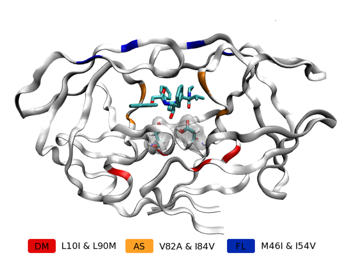
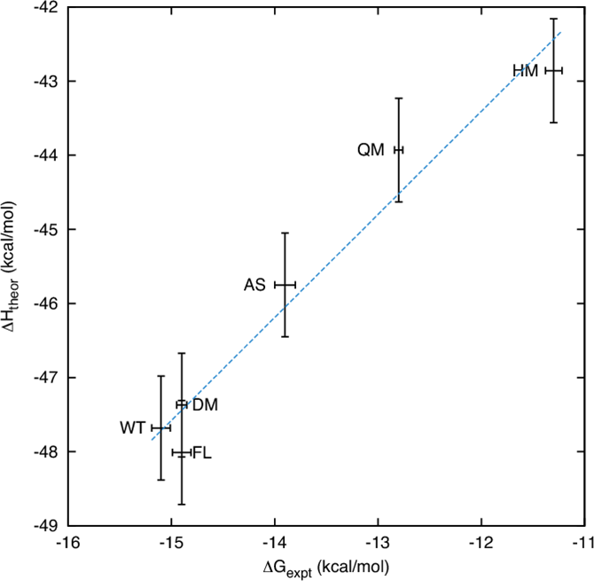
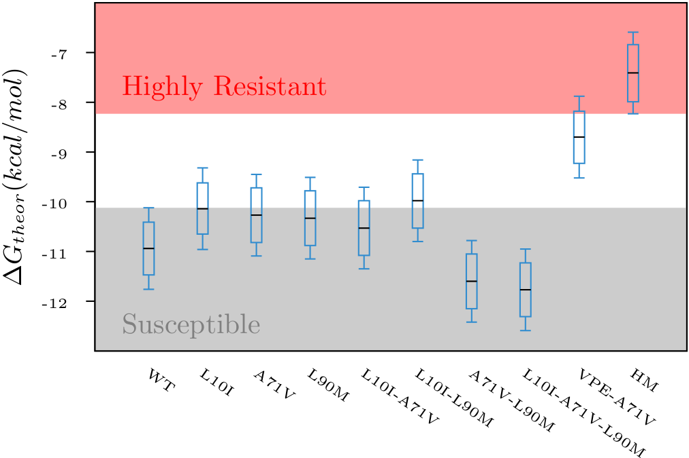

+++
title = "HIV-1 Protease Drug Binding and Resistance"
subtitle = "Insights from molecular dynamics simulations and binding affinity calculations."

date = 2013-02-18T00:00:00
lastmod = 2018-12-02T00:00:00
draft = false

# Authors. Comma separated list, e.g. `["Bob Smith", "David Jones"]`.
authors = ["David W. Wright"]

tags = ["HIV", "Protease", "Drug Resistance", "Molecular Dynamics", "BAC"]
summary = "Molecular dynamics provides quantitative and qualitative insight into this flexible protein."

# Projects (optional).
#   Associate this post with one or more of your projects.
#   Simply enter your project's folder or file name without extension.
#   E.g. `projects = ["deep-learning"]` references 
#   `content/project/deep-learning/index.md`.
#   Otherwise, set `projects = []`.
# projects = ["internal-project"]

# Featured image
# To use, add an image named `featured.jpg/png` to your project's folder.
[image]
  # Caption (optional)
  caption = "Graphic by Hugh Martin."

  # Focal point (optional)
  # Options: Smart, Center, TopLeft, Top, TopRight, Left, Right, BottomLeft, Bottom, BottomRight
  focal_point = ""

  # Show image only in page previews?
  preview_only = false
+++

The free energy change of biomolecular association (sometimes known as
binding affinity) is arguably one of the most important physical
quantities in biochemistry, governing the myriad processes that occur in
living organisms as well as being one of the pivotal determinants in
biomedical therapy and pharmaceutical activity. The use of molecular
dynamics simulations to compute accurate estimates of binding affinity
is a major field of research. I have been heavily involved in research
aiming to use such techniques to evaluate the binding affinity of
different variants of [HIV-1
protease](http://en.wikipedia.org/wiki/HIV-1_protease) to drugs designed
to inhibit it. The emergence of drug resistance is a major challenge for
the effective treatment of HIV and much of my work in this field has
been performed in projects (such as [CHAIN](http://www.chain-hiv.eu/)
and [ViroLab](http://www.virolab.org/)) which aim to identify and
characterize sequences that are resistant to different drugs.

HIV protease is a good test case for free energy calculations as it is
relatively small (it consists of a dimer of two 99 amino acid long
chains) and its clinical relevance has resulted in it being extensively
studied both experimentally and computationally. If rapid and accurate
assessments of binding affinities of different drugs to HIV protease
could be made these could have direct application in drug discovery and
even inform clinical decision support systems.

Ranking of Clinically Relevant Protease Inhibitors
--------------------------------------------------

Having previously shown the ability to rank mutant HIV-1 proteases to
the single inhibitor lopinavir (see below), we expanded our work to
investigate all nine FDA-approved HIV-1 protease inhibitors. As part of
this work we also performed a detailed analysis of the performance of
MMPBSA and the related molecular mechanics generalized Born surface area
(MMGBSA) free energy calculation methods. We confirmed our previous
results observing that ensemble simulations allow the computation of
converged and reproducible free energy estimates. This comes despite our
results showing that the values obtained from replica simulations of the
same protease−drug complex, differing only in initially assigned atom
velocities, can vary by as much as 10 kcal/mol, which is greater than
the difference between the best and worst binding inhibitors under
investigation.

For seven inhibitors, we find that with correctly converged normal mode
estimates of the configurational entropy, we can correctly distinguish
inhibitors in agreement with experimental data for both the MMPBSA and
MMGBSA methods and thus have the ability to rank the efficacy of binding
of this selection of drugs to the protease (no account is made for free
energy penalties associated with protein distortion leading to the over
estimation of the binding strength of the two largest inhibitors
ritonavir and atazanavir). We obtain improved rankings and estimates of
the relative binding strengths of the drugs by using a novel combination
of MMPBSA/MMGBSA with normal mode entropy estimates and the free energy
of association calculated directly from simulation trajectories.

-   **D. W. Wright**, B. A. Hall, O. A. Kenway, S. Jha and P. V.
    Coveney, "Computing Clinically Relevant Binding Free Energies of
    HIV-1 Protease Inhibitors", *Journal of Chemical Theory and
    Computation*, 2014, 10 (3),
    DOI:[10.1021/ct4007037](http://dx.doi.org/10.1021/ct4007037)

One of my co-authors had a protease model 3D printed and helped this
work come to the attention of the
[BBC](http://www.bbc.co.uk/news/science-environment-26213522). One day I
will have one of my own, until then I will remain jealous.

Correct Ranking of Lopinavir Binding Strength to Protease Mutants
-----------------------------------------------------------------

In order for molecular dynamics simulations to be useful in any real
application, the results derived from them need to be well conserved and
reproducible. We have found that the necessary sampling required to
achieve this goal is most efficiently acquired by using many short
simulations rather than single long ones. We used this observation to
gain well converged binding free energy estimates for the drug lopinavir
bound to sequences of HIV-1 protease, which have been shown
experimentally to exhibit a range of binding strengths.

A variety of free energy calculation techniques are available but the
requirement for rapid answers in both clinical and drug discovery
applications have led us to use the molecular mechanics
Poisson−Boltzmann surface area (MMPBSA) method which reduces the cost of
calculations at the expense of being less theoretically rigorous than
some other methods. Using this approach we produced a ranking of 6 HIV-1
variants to the inhibitor lopinavir with a correlation coefficient of
0.98 (shown to the left, the locations of the mutations in the different
variants are shown in the picture above). Incorporating normal mode
estimates of conformational entropy allows us to obtain a completely
correct rank ordering but with a reduced correlation coefficient of
0.89. To obtain these results, we used ensembles of 50 simulations each
run for 6 ns. The changes in binding affinity were seen to correlate
strongly with entry of additional water molecules into the protease
active site.

-   S. K. Sadiq, **D. W. Wright**, O. A. Kenway and P.V. Coveney,
    "Accurate Ensemble Molecular Dynamics Binding Free Energy Ranking
    of Multidrug-Resistant HIV-1 Proteases", *Journal of Chemical
    Information and Modeling*, 2010, 50 (5), DOI:
    [10.1021/ci100007w](http://dx.doi.org/10.1021/ci100007w)

Different Resistance Mechanisms
-------------------------------

We have shown that the water entry mechanism of resistance observed in
our simulations of lopinavir bound HIV-1 protease also applies in the
case of the related inhibitor ritonavir.

-   B. A. Hall, **D. W. Wright**, S. Jha and P. V. Coveney, "Quantized
    water access to the HIV-1 protease active site as a mechanism for
    cooperative changes in drug affinity", *Biochemistry*, 2012, 51 (33),
    DOI: [10.1021/bi300432u](http://dx.doi.org/10.1021/bi300432u)

However, a study based on a patient derived sequence has shown that we
can also use ensemble molecular dynamics simulations to characterize
other resistance pathways. In particular, I have shown that mutations at
position 71 cause changes in the relative conformation of the two beta
sheets that form the protease dimer interface. These changes are
associated with changes in drug binding affinity and in some cases
enzymatic efficacy.

-   **D. W. Wright**, and P. V. Coveney, "Resolution of Discordant
    HIV-1 Protease Resistance Rankings Using Molecular Dynamics
    Simulations", *Journal of Chemical Information and Modeling*, 2011,
    51 (10), DOI:
    [10.1021/ci200308r](http://dx.doi.org/10.1021/ci200308r)

Automation of Simulation and Analysis
-------------------------------------

The preparation execution and free energy analysis of the simulations in
all the studies described on this page were automated using a set of
scripts known as binding affinity calculator (BAC).

-   S. K. Sadiq, **D. W. Wright**, S. J. Watson, S. J. Zasada and P. V.
    Coveney, "Automated Molecular Simulation Based Binding Affinity
    Calculator for Ligand-Bound HIV-1 Proteases", 2008, 48 (9), DOI:
    [10.1021/ci8000937](http://dx.doi.org/10.1021/ci8000937)

We are now working to update this infrastructure to make use of the
Simple API for Grid Applications
([SAGA](https://github.com/saga-project)) and the extension
[BigJob](http://saga-project.github.com/BigJob/) which allows the simple
distribution of simulations within an ensemble across multiple
computers.
