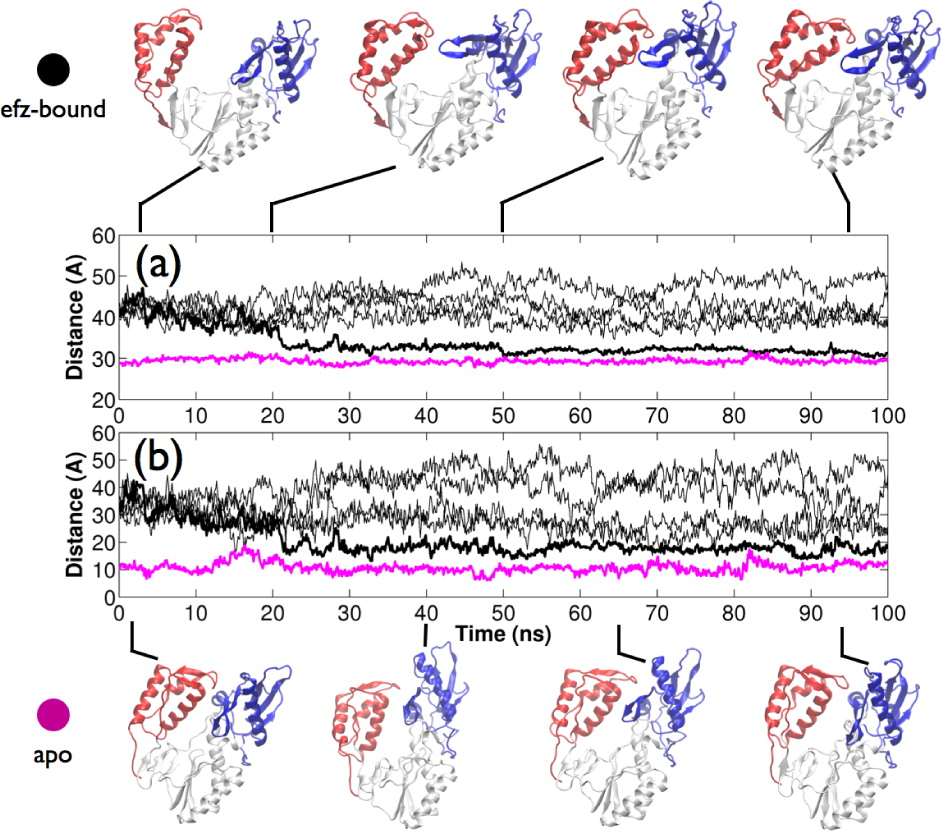

+++
title = "Investigating the Impact of Drug Binding on HIV Reverse Transcriptase Structure and Dynamics"
subtitle = "Confirmational changes and allosteric drug interactions."

date = 2013-02-18T00:00:00
lastmod = 2018-12-02T00:00:00
draft = false

# Authors. Comma separated list, e.g. `["Bob Smith", "David Jones"]`.
authors = ["David W. Wright"]

tags = ["HIV", "Reverse Transcriptase", "Molecular Dynamics"]
summary = "RT is a major anti-HIV drug target where ligand binding can change the dynamics far from the binding site."

# Projects (optional).
#   Associate this post with one or more of your projects.
#   Simply enter your project's folder or file name without extension.
#   E.g. `projects = ["deep-learning"]` references 
#   `content/project/deep-learning/index.md`.
#   Otherwise, set `projects = []`.
# projects = ["internal-project"]

# Featured image
# To use, add an image named `featured.jpg/png` to your project's folder.
[image]
  # Caption (optional)
  caption = ""

  # Focal point (optional)
  # Options: Smart, Center, TopLeft, Top, TopRight, Left, Right, BottomLeft, Bottom, BottomRight
  focal_point = ""

  # Show image only in page previews?
  preview_only = false
+++

HIV-1 reverse transcriptase
([RT](http://en.wikipedia.org/wiki/Reverse_transcriptase)) is a
multifunctional enzyme responsible for the transcription of the RNA
genome of the HIV virus into DNA suitable for incorporation within the
DNA of human host cells. 



HIV-1 RT is a heterodimer consisting of a p66 and a p51 subunit. In Figure 1 the domains of p66 are individually colored: the fingers are shown in blue, the palm gray, the thumb red, the connection yellow, and
the RNaseH green. The p51 subunit is shown in white. 
The location of the polymerase active site triad is depicted in orange. 
The location of the bound drug efavirenz (an NNRTI, see below) is shown in magenta. 
The view along the binding cleft illustrates the resemblance of the p66 subunit to an opened hand."

The enzyme uses the single stranded RNA viral
genome as a template to create a single strand of DNA which is in turn
used as a template to create a double stranded DNA (dsDNA) copy of the
genome. The dsDNA copy is then ready to be integrated into the
chromosomes of host cells. HIV-1 RT has two distinct active sites, known
as the polymerase and RNaseH active sites respectively. At the
polymerase active site incoming nucleotides matching the template RNA or
DNA are incorporated into the growing complementary DNA chain. The
RNaseH active site catalyses the breakdown of the RNA genome, freeing
the DNA copy to act as a template for the creation of the final double
stranded DNA genome. Inhibition of either enzymatic activity compromises
viral replication and its crucial role in the HIV life cycle has made it
one of the principal targets for antiretroviral drug therapy. Two
classes of inhibitor are currently in clinical use, called nucleotide
analogue RT inhibitors
([NRTIs](http://en.wikipedia.org/wiki/Reverse-transcriptase_inhibitor#Nucleoside_analog_reverse-transcriptase_inhibitors_.28NARTIs_or_NRTIs.29))
and non-nucleoside analogue RT inhibitors
([NNRTIs](http://en.wikipedia.org/wiki/Reverse-transcriptase_inhibitor#Non-nucleoside_reverse-transcriptase_inhibitors_.28NNRTIs.29)).
The former mimic the natural deoxynucleotide triphosphate (dNTP)
substrate, binding to nascent DNA chains and acting as chain terminators
preventing further elongation. NNRTIs operate allosterically, binding
approximately 10 Å from the polymerase active site in a pocket which
does not exist in the apo enzyme, inhibiting the enzyme allosterically.
I have used molecular dynamics and coarse grained network models to
investigate the impact of NNRTIs on the structure and dynamics of HIV-1
RT.

Thumbs Down: Domain Rearrangements in NNRTI Bound RT
====================================================

It is widely believed that NNRTIs function as "molecular wedges",
disrupting the region between thumb and palm subdomains of the p66
subunit and locking the thumb in a wide-open conformation. Crystal
structure data suggest that the binding of NNRTIs forces RT into a
wide-open conformation in which the separation between the thumb and
fingers subdomains is much higher than in the apo structure. Using
ensemble molecular dynamics simulations (aggregate sampling 600 ns), we
have captured RT bound to the NNRTI efavirenz (efz) in a closed
conformation similar to that of the apo enzyme, suggesting the
constraint of thumb motion is not as complete as previously believed.
Our simulations confirm that a conformational distribution across open
and closed states must exist in the drug-bound enzyme and that
allosteric modulation is effected via the alteration of the kinetic
landscape of conformational transitions upon drug-binding.

-   **D. W. Wright**, S. K. Sadiq, G. De Fabritiis and P. V. Coveney,
    "Thumbs down for HIV: Domain level rearrangements do occur in the
    NNRTI bound HIV-1 Reverse Transcriptase", *Journal of the American
    Chemical Society*, 2012, 134 (31),
    DOI:[10.1021/ja301565k](http://dx.doi.org/10.1021/ja301565k)

Global Dynamics of NNRTI bound HIV-1 RT Bound
=============================================

Using both coarse grained network models and atomistic molecular
dynamics we explored changes in protein dynamics induced by NNRTI
binding. We identify changes in the flexibility and conformation of
residue Glu396 in the RNaseH primer grip which could provide an
explanation for the acceleration in RNaseH cleavage rate observed
experimentally in NNRTI bound HIV-1 RT. Unlike previous network models
we did not see significant differences in the motions predicted by the
network models for different NNRTIs, rather we see that the motions are
altered by differences in the conformation captured
crystallographically. Additionally, we suggest a plausible path for
conformational and dynamic changes to be communicated from the vicinity
of the NNRTI binding pocket to the RNaseH at the other end of the
enzyme.

-   **D. W. Wright**, B. A. Hall, P. Kellam and P. V. Coveney, "Global
    Conformational Dynamics of HIV-1 Reverse Transcriptase Bound to Non
    Nucleoside Inhibitors", *Biology*, 2012, 1 (2), DOI:
    [10.3390/biology1020222](http://dx.doi.org/10.3390/biology1020222)

