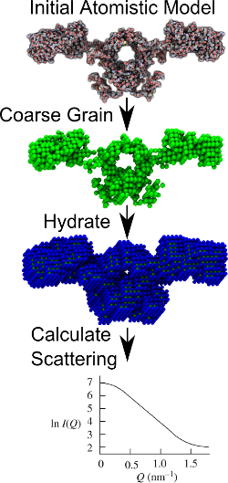
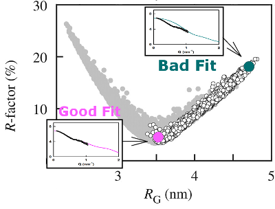

+++
title = "Modelling Small Angle Scattering Data"
subtitle = "Understanding low resolution expeirmental evidence through atomistic modelling."

date = 2014-02-18T00:00:00
lastmod = 2018-12-02T00:00:00
draft = false

# Authors. Comma separated list, e.g. `["Bob Smith", "David Jones"]`.
authors = ["David W. Wright"]

tags = ["Small Angle Scattering", "SAXS", "SANS"]
summary = "Overview of my work using atomic models to interpret SAXS and SANS data."

# Projects (optional).
#   Associate this post with one or more of your projects.
#   Simply enter your project's folder or file name without extension.
#   E.g. `projects = ["deep-learning"]` references 
#   `content/project/deep-learning/index.md`.
#   Otherwise, set `projects = []`.
# projects = ["internal-project"]

# Featured image
# To use, add an image named `featured.jpg/png` to your project's folder.
[image]
  # Caption (optional)
  caption = ""

  # Focal point (optional)
  # Options: Smart, Center, TopLeft, Top, TopRight, Left, Right, BottomLeft, Bottom, BottomRight
  focal_point = ""

  # Show image only in page previews?
  preview_only = false
+++

In August 2013 I joined [CCP-SAS](http://ccpsas.org/), a joint US/UK
collaborative software development project to provide the infrastructure
and tools for analysing small angle scattering data on complex systems
using atomistic and coarse grained modeling approaches.

Small angle X-ray and neutron scattering techniques (known as SAXS and
SANS respectively, or collectively as small angle scattering, SAS)
characterize proteins in solution and complement high-resolution
structural studies. They are of particular utility when large proteins
cannot be crystallized and in systems where solution conditions affect
the structure adopted. Atomistic models of the average structure can be
generated through constrained modelling, a technique in which known
structures (such as domain or subunit crystal structures) are combined
with linker models to produce candidate global conformations. By
randomizing the configuration adopted by the different elements of the
model thousands of candidate structures can be produced. Theoretical
scattering curves are then generated for each model and used for
trial-and-error fits to the experimental data. From this a small family
of best-fit models can be identified.

Within this project I am not only writing software but also conducting
my own research as well as facilitating the use of a variety of
modelling techniques (some of which we are developing in CCP-SAS) in
other peoples SAS based research. Currently I am investigating monomer
IgA1 and developing tools to build antibody structures incorporating
carbohydrates. I am also hoping to contribute to the
[SASSIE](http://www.smallangles.net/sassie/SASSIE/SASSIE_HOME.html) tool
which is designed to generate and manipulate large numbers of atomistic
structures and to calculate the SANS, SAXS, and neutron reflectivity
profiles from them.

*Update:* In the time since I first wrote this post I did infact contribute to SASSIE, in particular on the PDB Scan and PDB Rx modules for evaluating and completeing atomistic structures in perparation for modelling.
These tools are available online in [SASSIE-web](https://sassie-web.chem.utk.edu/).

SCT: Comparing Atomistic Models to SAS Data
===========================================

In the [Structural Immunology Group](http://www.ucl.ac.uk/smb/perkins)
at [UCL](http://www.ucl.ac.uk) we have developed a suite of tools,
called SCT, in order to facilitate both the computation of theoretical
scattering curves from atomistic models and their comparison to
experiment. The SCT suite also includes programs which add a hydration
layer to models, necessary for comparison to data from X-ray scattering,
and provide sequence based estimates of protein volume (both
incorporating hydration and not). 

The original SCT software, written in
Fortran, has been used in the production of 71 structures (18
antibodies, 27 complement proteins and 24 oligosaccharides) deposited in
the Protein Data Bank between 1998-2013. For the first time we are now
making this software publicly available, alongside an easier-to-use
reimplementation of the same algorithms in Python. SCT has now been made
available under the Apache 2.0 license via
[GitHub](https://github.com/dww100/sct).

- **D. W. Wright** &  S. J. Perkins, "SCT: a suite of programs for comparing atomistic models with small-angle scattering data", *J. Appl. Cryst.*, 2015,  48, DOI: [10.1107/S1600576715007062](http://dx.doi.org/10.1107/S1600576715007062)
